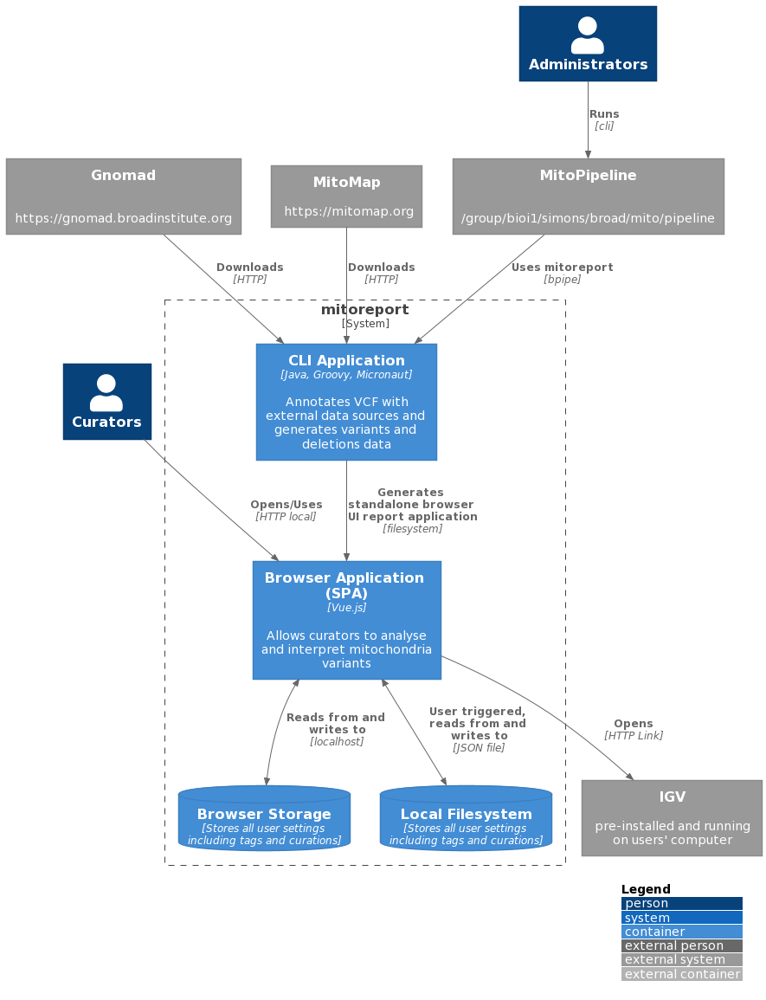

# MitoReport Architecture

MitoReport itself is a command line application that requires only Java to run. It takes VCF files and BAM files as
input and writes out an HTML report that can be loaded in a browser or distributed on a web server for users to access.

The diagram below shows the overall architecture of MitoReport and how external components and systems interact with it.



```plantuml
@startuml

!include https://raw.githubusercontent.com/plantuml-stdlib/C4-PlantUML/master/C4_Container.puml

LAYOUT_TOP_DOWN()
LAYOUT_WITH_LEGEND()

Person(curators, "Curators")
Person(admins, "Administrators")

System_Boundary(c1, "mitoreport"){

    Container(ui, "Browser Application (SPA)", "Vue.js", "Allows curators to analyse and interpret mitochondria variants")

    Container(mitoreport, "CLI Application", "Java, Groovy, Micronaut", "Annotates VCF with external data sources and generates variants and deletions data")

    ContainerDb(browser_storage, "Browser Storage", "Stores all user settings including tags and curations")

    ContainerDb(local_fs, "Local Filesystem", "Stores all user settings including tags and curations")

}

System_Ext(gnomad, "Gnomad", "https://gnomad.broadinstitute.org")
System_Ext(mitomap, "MitoMap", "https://mitomap.org")
System_Ext(mito_pipeline, "MitoPipeline", "/group/bioi1/simons/broad/mito/pipeline")
System_Ext(igv, "IGV", "pre-installed and running on users' computer")


Rel(curators, ui, "Opens/Uses", "HTTP local")
Rel(admins, mito_pipeline, "Runs", "cli")
Rel(mitoreport, ui, "Generates standalone browser UI report application", "filesystem")
Rel(mito_pipeline, mitoreport, "Uses mitoreport", "bpipe")
Rel(gnomad, mitoreport, "Downloads", "HTTP")
Rel(mitomap, mitoreport, "Downloads", "HTTP")
Rel(ui, igv, "Opens", "HTTP Link")

BiRel(ui, local_fs, "User triggered, reads from and writes to", "JSON file")
BiRel(ui, browser_storage, "Reads from and writes to", "localhost")

@enduml
```
