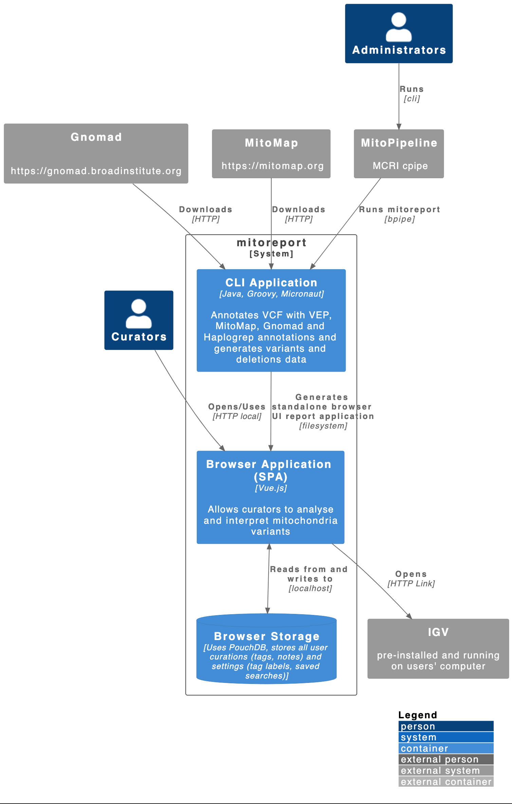

# MitoReport Architecture

MitoReport itself is a command line application that requires only Java to run. It takes VCF files and BAM files as
input and writes out an HTML report that can be loaded in a browser or distributed on a web server for users to access.

TODO: Add new diagram for syncing architecture using PouchDB and CouchDB

The diagram below shows the overall architecture of MitoReport and how external components and systems interact with it.

<!--  -->

```plantuml
@startuml

!include https://raw.githubusercontent.com/plantuml-stdlib/C4-PlantUML/master/C4_Container.puml

LAYOUT_TOP_DOWN()
LAYOUT_WITH_LEGEND()

Person(curators, "Curators")
Person(admins, "Administrators")

System_Boundary(c1, "mitoreport"){

    Container(ui, "Browser Application (SPA)", "Vue.js", "Allows curators to analyse and interpret mitochondria variants")

    Container(mitoreport, "CLI Application", "Java, Groovy, Micronaut", "Annotates VCF with VEP, MitoMap, Gnomad and Haplogrep annotations and generates variants and deletions data")

    ContainerDb(browser_storage, "Browser Storage", "Uses PouchDB, stores all user curations (tags, notes) and settings (tag labels, saved searches)")
    
    ' ContainerDb(remote_storage, "Remote Storage", "Optional hosted CouchDB, syncs data from browser_storage")
}

System_Ext(gnomad, "Gnomad", "https://gnomad.broadinstitute.org")
System_Ext(mitomap, "MitoMap", "https://mitomap.org")
System_Ext(mito_pipeline, "MitoPipeline", "MCRI cpipe")
System_Ext(igv, "IGV", "pre-installed and running on users' computer")

Rel(curators, ui, "Opens/Uses", "HTTP local")
Rel(admins, mito_pipeline, "Runs", "cli")
Rel(mitoreport, ui, "Generates standalone browser UI report application", "filesystem")
Rel(mito_pipeline, mitoreport, "Runs mitoreport", "bpipe")
Rel(gnomad, mitoreport, "Downloads", "HTTP")
Rel(mitomap, mitoreport, "Downloads", "HTTP")
Rel(ui, igv, "Opens", "HTTP Link")

BiRel(ui, browser_storage, "Reads from and writes to", "localhost")
' BiRel(browser_storage, remote_storage, "Syncs")

@enduml
```
